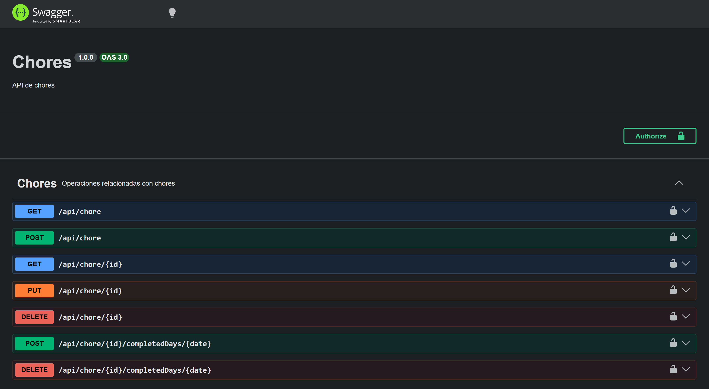

# Gestor de tareas cotidianas
Una aplicación web para la gestión y seguimiento de la realización de tareas cotidianas de personas mayores. Parte back de la aplicación con Node.js.

## Descripción
Se ha diseñado una API tipo CRUD de tareas cotidianas, también conocidas como chores en inglés, que puede utilizarse para gestionar dichas tareas. Una chore se compone de:
- ID: Identificador de la chore en base de datos.
- userId: Identificador del usuario al que pertenece la chore.
- name: Nombre descriptivo de la chore.
- category: Categoría única de la chore.
- duration: El tiempo diario estimado que se tarda en completar la chore en minutos.
- startDate: Fecha en la que comenzó a realizarse la chore.
- endDate: Fecha en la que terminará la realización de la chore.
- completedDays: Un array de fechas que funciona como una checklist de días en los que la chore ha sido realizada.

## Instalación y ejecución

- Obtener un `.env` válido o crear uno propio partiendo de `.env.example`.
- Instalar todos los paquetes necesarios con el comando: `npm install`.
- Arrancar la aplicación con `npm start`.

## Tecnologías y paquetes utilizados
- Node.js: Framework de desarrollo.
- Express: Framework para la API.
- dotenv: Gestión de variables de entorno.
- cors: Para permitir accesos de diferentes dominios.
- swagger-ui-express: Para proporcionar una ruta con la documentación de la API.
- MongoDB Atlas: Motor de base de datos de la aplicación, utilizado por simplicidad.
- Mongoose: Interfaz para administrar el modelo de datos y subirlo a MongoDB Atlas.
- Firebase: Plataforma a la que delegamos la identificación de usuarios. Los usuarios solo nos envían un token de acceso JWT en las peticiones.
- firebase-admin: Interfaz para interactuar con Firebase y validar tokens de acceso.

## Rutas

- `GET /api/chore`: Obtiene todas las chores de un usuario.
- `GET /api/chore/{id}`: Obtiene una chore de un usuario por su ID.
- `POST /api/chore`: Crea una nueva chore para un usuario.
- `PUT /api/chore/{id}`: Actualiza una chore de un usuario.
- `DELETE /api/chore/{id}`: Borra una chore de un usuario.
- `POST /api/chore/{id}/completedDays/{date}`: Añade una fecha al array de días completados de la chore.
- `DELETE /api/chore/{id}/completedDays/{date}`: Borra una fecha del array de días completados de una chore.

## Versión de prueba y documentación

En los siguientes enlaces se proporcionan una versión de prueba del backend y una documentación más completa de los endpoint mediante Swagger. Si se hostea la aplicación, la documentación será accesible desde el endpoint `/api-docs`.
- LINK_PROYECTO
- LINK_DOC
